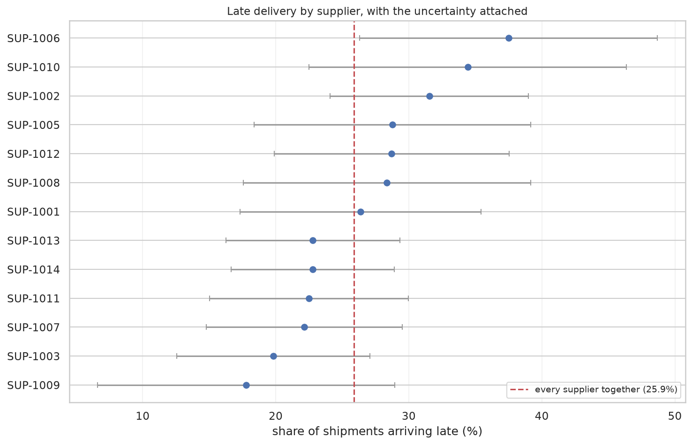
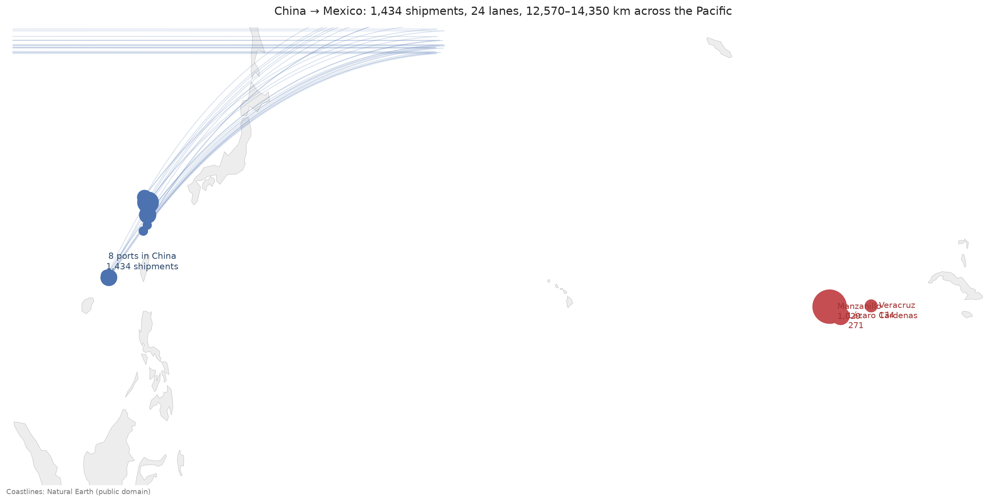
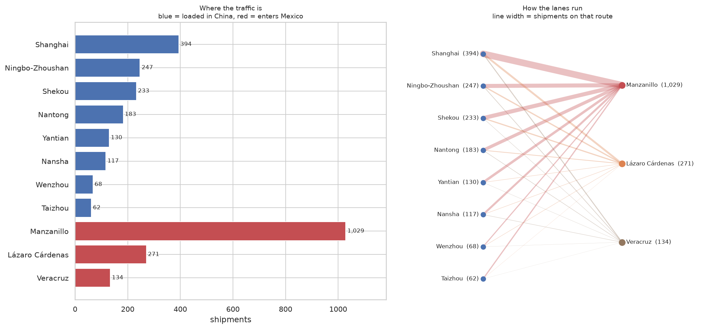
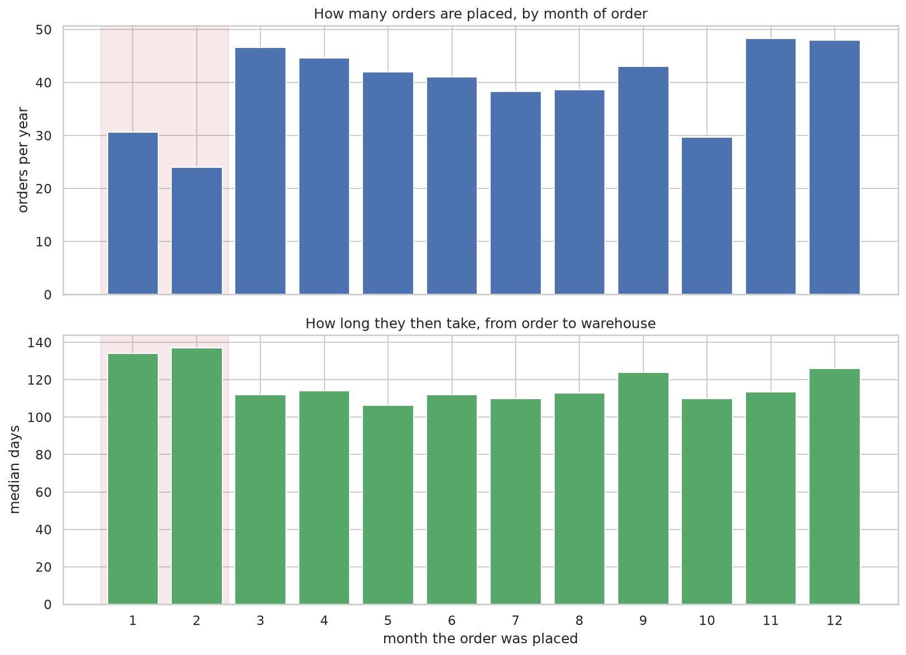
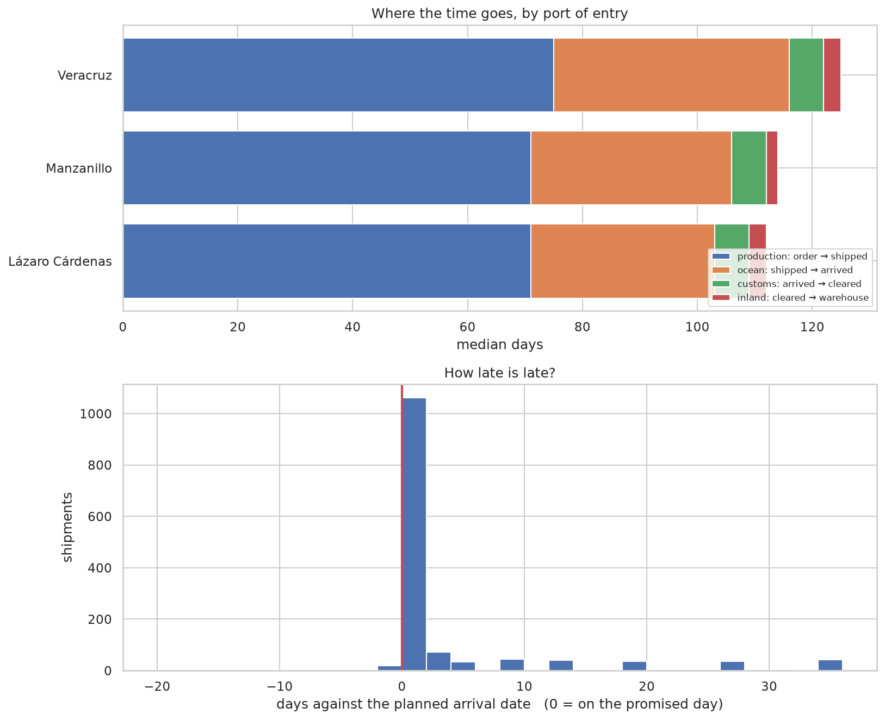
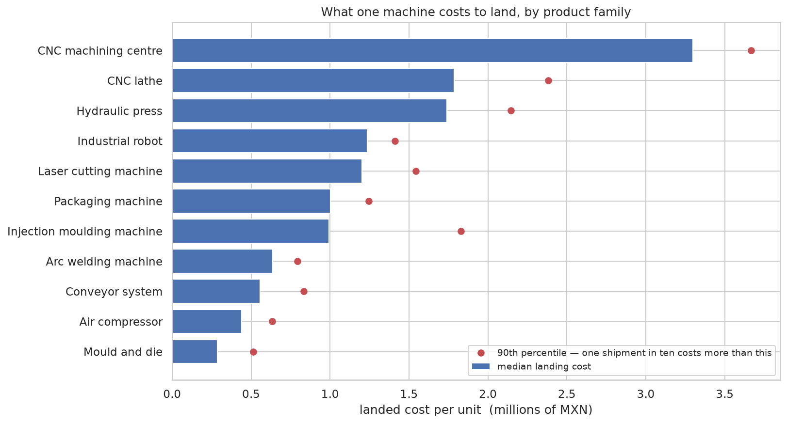

# China → Mexico Machinery Imports — Repairing a Two-System Operations File

A Guadalajara importer buys industrial machinery from eight suppliers across three Chinese
provinces, ships it through three Mexican ports, and pays duty, customs brokerage, drayage and
demurrage before the goods reach the warehouse. Its operations file is a merge of the ERP export
and the customs broker's portal, and the two systems disagree about almost everything.

This repository takes that file apart: **1,458 rows in, 1,440 shipments described**, with twenty
defects found, documented and decided on.

> **All data is synthetic.** The company, suppliers, ports and transactions are fictional, generated
> to model a real import operation — defects included, on purpose. No real organisation is
> represented. See [`data/external/SOURCE.md`](data/external/SOURCE.md) for the one non-synthetic
> asset in the repository, which is public-domain geography.

---

## What the file turned out to be

| | |
| --- | --- |
| Rows in the file | 1,458 |
| Shipments actually described | **1,440** — 12 rows copied whole, 6 entered twice under a second id |
| Columns | 38, across 4 files |
| Defects found | **20**, in the [findings table](data/processed/findings.csv) |
| Ambiguous dates resolved without a guess | 1,765 |
| Shipments where an independent test contradicts the record | 45 |
| Duty the declared tariff codes imply beyond what was paid | **MXN 1,207,422** |

## The headline findings

**The file contradicts itself on duty for 16 shipments.** A shipment declares a tariff code, and the
duty it paid implies a different rate. The money is the tiebreaker: where the payment matches the
product master's code, the code is the error; where it matches the declared code, the SKU is. Twelve
shipments have the wrong code, four have the wrong product, and reading the declarations literally
implies 1.2 million pesos of duty more than was paid.

**One shipment in four misses its promised date**, by eight days at the median when it does — but a
third of the late ones are more than two weeks late. Typical lateness and plan-for lateness are
different numbers.

**February is the worst month on all three measures at once.** 24 orders a year against November's
48, a median lead time of 137 days against May's 106, and 35% arriving late against August's 20%.
One cause, three symptoms: Chinese New Year.

**72% of everything enters through one port**, and 45% of it loads through two ports on the same
stretch of coast.

**And most of a 34-day ocean leg cannot be explained by sailing.** The distance is 12,570–14,350 km —
even at a sustained 20 knots on the shortest possible line, that is about 15 days. The remaining
19-plus days are waiting, transshipment and berth time, not movement.

## What the analyst declined to conclude

The most useful-looking output the data could have produced was a supplier league table. **It isn't
published, because the data cannot support one.** The spread in late-delivery rate between the best
and worst supplier is 19.7 points; the 95% confidence interval attached to a single supplier's rate
is 23.8 points wide. Every interval overlaps every other one, and a chi-square test returns
p = 0.118. Ranking on noise would have produced a confident, wrong answer.



## The route and the traffic





## Time, cost and seasonality







Goods are **85% of landed cost**. Everything the operation controls — freight, duty, brokerage,
drayage, demurrage — is the other 15%, and the largest controllable line is duty at 8.8%, which is
exactly why the tariff-code finding above matters.

## How it was built

One notebook, in this order, each block depending on the last:

| Block | What it does |
| --- | --- |
| **Loading** | Reads four files as text, with the encoding each is actually stored in — one is Latin-1, one carries a byte-order mark |
| **Profiling** | Inventories every column before repairing anything: blanks, distinct values, and six patterns that should not be there |
| **Dates** | Four formats mixed row by row. 41% of the slash values are readable two ways, resolved from evidence inside each row, then by the order of events, then by the purchase-order number — never by a default |
| **Keys** | Supplier and product codes repaired in stages, each resting on stronger evidence than the last, and stopped where the damage stops being mechanical |
| **Join** | Attaches the product and supplier masters — after checking them for repeated codes, which would otherwise have invented 236 shipments |
| **Money** | Turns twelve columns of text into numbers, including 53 values written the European way, where reading the comma as a thousands separator would be a 1,000× error |
| **Duplicates** | 1,458 rows down to 1,440 shipments, with the reason recorded for each pair |
| **Derived** | Lead times, delays, landed cost in both currencies, and the composition of that cost |
| **SQL** | The same questions asked a second way through SQLite, and cross-checked against the first — which is how a NULL-handling difference between pandas and SQL surfaced |
| **EDA** | Seasonality, routes, delay distribution, cost per unit, and the tariff exposure |
| **Export** | The cleaned table and the findings table, as CSV and as a two-sheet workbook |

The judgement calls behind it are written down in the notebook's **decision log** — nineteen of
them, each with what changes if it is wrong.

## How to run it

```bash
git clone https://github.com/aanaya-hub/mx-machinery-imports.git
cd mx-machinery-imports
python3 -m venv .venv && source .venv/bin/activate
pip install -r requirements.txt
```

Open `notebooks/01-data-repair-and-eda.ipynb` in VS Code or Jupyter and **Run All**. It builds
`imports.db` in the project folder, writes the figures into `reports/figures/`, and exports the
cleaned data to `data/processed/`. No API keys, no network calls, no services.

## What I would do next

1. **Get the 16 tariff contradictions ruled on** by someone who can see the original declarations.
   The remedy is correcting the codes, not paying the difference.
2. **Establish whether the 15 impossible timelines are import errors or record-keeping ones** —
   that decision has been deferred, and it blocks using those rows in any timing analysis.
3. **Test the 6 flagged price and quantity errors against the purchase orders** rather than
   inferring the correct values from the file.
4. **Model it.** The repaired table supports predicting delayed arrival at order time, which is
   notebook 2.

## Limitations

- **Synthetic data.** The patterns are realistic; the magnitudes are invented. Nothing here is a
  market statistic.
- **No ground truth.** Nothing was validated against a trusted source, so there is no accuracy
  percentage to quote. What exists is a trail of evidence: every defect, its row count, and the
  decision taken.
- **The distance analysis is a floor, not a measurement.** Great-circle distance is shorter than any
  sailable route and 20 knots is optimistic for a container ship, so the "not sailing" share is
  overstated — which is why the weaker conclusion is the one stated.
- **Two rows and six cells stay unresolved**, listed in the findings table. They are reported, never
  guessed at.

## Credits

Coastlines: [Natural Earth](https://www.naturalearthdata.com/) (public domain).
Built with Python 3.13, pandas 3.0, GeoPandas and scikit-learn — see `requirements.txt`.
